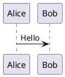

# 文档查看器使用说明

## 简介

`view_documentation.html` 是一个独立的 HTML 文件，可以读取和渲染 Markdown 文档，并自动将文档中的 PlantUML 代码块转换为图表。

## 功能特性

- ✅ 支持 Markdown 文档渲染
- ✅ 自动识别并渲染 PlantUML 图表
- ✅ 支持文件选择器加载文档
- ✅ 支持拖放文件
- ✅ 自动生成目录导航
- ✅ 响应式设计，支持移动设备
- ✅ 美观的 UI 界面

## 使用方法

### 方法一：直接打开 HTML 文件

1. 双击 `view_documentation.html` 文件，在浏览器中打开
2. 点击"加载默认文档"按钮，自动加载同目录下的 `PROJECT_ANALYSIS.md` 文件
3. 或者点击"选择文件"按钮，手动选择要查看的 Markdown 文件

### 方法二：使用文件选择器

1. 打开 `view_documentation.html`
2. 点击文件输入框或"选择文件"按钮
3. 选择要查看的 `.md` 或 `.markdown` 文件
4. 文档会自动加载并渲染

### 方法三：拖放文件

1. 打开 `view_documentation.html`
2. 直接将 Markdown 文件拖放到页面内容区域
3. 文档会自动加载并渲染

## PlantUML 支持

查看器支持两种 PlantUML 代码块格式：

### 格式一：代码块格式

````markdown

````

### 格式二：内联格式

```markdown
@startuml
Alice -> Bob: Hello
@enduml
```

## 注意事项

1. **网络连接**：PlantUML 图表需要访问在线服务器（`www.plantuml.com`）来渲染，请确保网络连接正常。

2. **CORS 限制**：如果从 `file://` 协议打开 HTML 文件，某些浏览器可能会阻止加载外部资源。建议：
   - 使用本地 Web 服务器（如 Python 的 `http.server` 或 Node.js 的 `http-server`）
   - 或者使用支持本地文件的浏览器（如 Chrome）

3. **文件路径**："加载默认文档"功能需要 `PROJECT_ANALYSIS.md` 文件与 HTML 文件在同一目录下。

## 使用本地 Web 服务器（推荐）

### Python 3

```bash
# 在项目根目录下运行
python -m http.server 8000
# 然后访问 http://localhost:8000/view_documentation.html
```

### Node.js (http-server)

```bash
# 安装 http-server（如果未安装）
npm install -g http-server

# 在项目根目录下运行
http-server -p 8000
# 然后访问 http://localhost:8000/view_documentation.html
```

### VS Code Live Server

1. 安装 "Live Server" 扩展
2. 右键点击 `view_documentation.html`
3. 选择 "Open with Live Server"

## 技术实现

- **Markdown 解析**：使用 [marked.js](https://marked.js.org/) 库
- **PlantUML 渲染**：使用 PlantUML 在线服务器 API
- **纯前端实现**：无需后端服务器，所有处理在浏览器中完成

## 故障排除

### PlantUML 图表无法显示

1. **检查网络连接**：确保可以访问 `www.plantuml.com`
2. **检查 PlantUML 代码**：确保代码语法正确
3. **查看浏览器控制台**：按 F12 打开开发者工具，查看错误信息
4. **尝试使用 HTTPS**：某些浏览器可能阻止混合内容（HTTP/HTTPS）

### 文件无法加载

1. **检查文件路径**：确保文件路径正确
2. **检查文件格式**：确保是 `.md` 或 `.markdown` 文件
3. **使用本地服务器**：如果从 `file://` 打开，尝试使用本地 Web 服务器

### 样式显示异常

1. **清除浏览器缓存**：按 Ctrl+F5 强制刷新
2. **检查浏览器兼容性**：建议使用现代浏览器（Chrome、Firefox、Edge、Safari）

## 浏览器兼容性

- ✅ Chrome/Edge (推荐)
- ✅ Firefox
- ✅ Safari
- ✅ Opera

## 许可证

本查看器为项目文档工具，可自由使用和修改。
